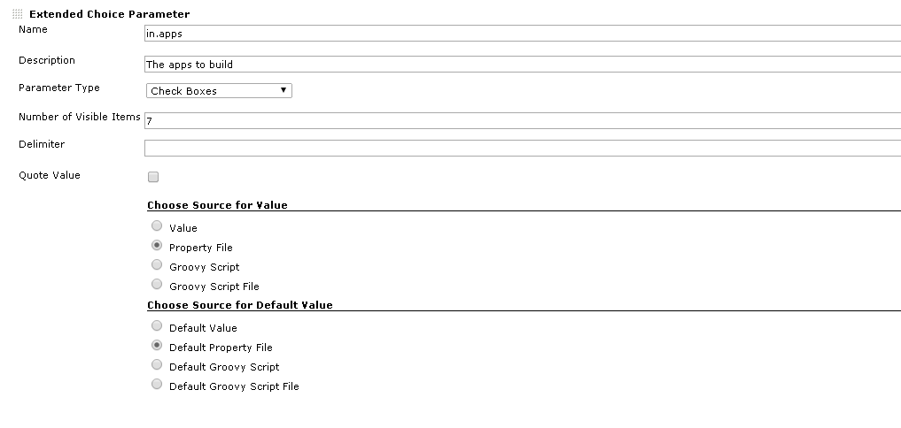

= Change Log
:toc:

== Version 0.64 (April 17, 2016)

Show user friendly error message for script approval issues.

Script security has been incorporated into this plugin for security
reasons. You may see warning messages related to security with
groovy-script execution from this version on-wards.

A warning message is displayed on the screen if the user tries to
execute groovy scripts that have not been approved. The message has a
link that takes the user to the screen where the scripts can be
approved. The user should have admin access to approve scripts.

== Version 0.61 (Mar 30, 2016)

* Use Script Security plugin for authorizing Groovy scripts.
* Allow `+${JOB_NAME}+` variable in properties and groovy file path expose project and jenkins
bindings in groovy script.

== Version 0.53 (Jun 2, 2015)

Use faster Boon JSON parser instead of built-in net.sef.JSON parser.

== Version 0.44 (Jun 2, 2015)

Added JSON Parameter feature based on json html editor by https://github.com/jdorn/json-editor[Jeremy
Dorn]

The groovy script should return a JSON object that corresponds to the
"options"  object referred to in
 https://github.com/jdorn/json-editor[json-editor]

Watched Fields Ex:

[source,groovy]
----
import org.boon.Boon;

def jsonEditorOptions = Boon.fromJson(/{
        disable_edit_json: true,
        disable_properties: true,
        no_additional_properties: true,
        disable_collapse: true,
        disable_array_add: true,
        disable_array_delete: true,
        disable_array_reorder: true,
        theme: "bootstrap2",
        iconlib:"fontawesome4",
        schema: {
          "type": "object",
          "title": "Name",
          "properties": {
            "first_name": {
              "type": "string",
              "propertyOrder" : 1
            },
            "last_name": {
              "type": "string",
              "propertyOrder" : 2
            },
            "full_name": {
              "type": "string",
              "propertyOrder" : 3,
              "template": "{{fname}} {{lname}}",
              "watch": {
                "fname": "first_name",
                "lname": "last_name"
              }
            }
          }
        },
        startval: {
            "first_name" : "John",
            "last_name" : "Doe",
            "full_name" : "John Doe"
        }
}/);

----

Color Picker Ex:

[source,groovy]
----
import org.boon.Boon;

def jsonEditorOptions = Boon.fromJson(/{
        disable_edit_json: true,
        disable_properties: true,
        no_additional_properties: true,
        disable_collapse: true,
        disable_array_add: true,
        disable_array_delete: true,
        disable_array_reorder: true,
        theme: "bootstrap2",
        iconlib:"fontawesome4",
        schema: {
          "title": "Color Picker",
          "type": "object",
          "properties": {
            "color": {
              "type": "string",
              "format": "color"
            }
          }
        },
        startval: {
            color :"red"
        }
}/);
----

Advanced Ex:

[source,groovy]
----
import org.boon.Boon;

def jsonEditorOptions = Boon.fromJson(/{
        disable_edit_json: true,
        disable_properties: true,
        no_additional_properties: true,
        disable_collapse: true,
        disable_array_add: true,
        disable_array_delete: true,
        disable_array_reorder: true,
        theme: "bootstrap2",
        iconlib:"fontawesome4",
       "schema":{
  "title": "Applications",
  "type": "array",
  "format":"tabs",
  "items": {
     "title": "Application",
     "headerTemplate": "{{self.name}}",
     "type": "object",
     "properties": {
        "name" : {
             "title": "application",
             "type": "string",
             "readOnly": "true"

         },
         "environments": {
             "title": "Environments",
             "type": "array",
             "format":"tabs",
             "items": {
                 "title": "Environment",
                 "headerTemplate": "{{self.name}}",
                 "type": "object",
                 "properties": {
                    "name" : {
                         "title": "environment",
                         "type": "string",
                         "readOnly": "true"

                     },
                     "properties": {
                         "type": "array",
                         "format": "table",
                         "items": {
                             "type": "object",
                              "properties": {
                                  "name" : {
                                      "type": "string",
                                      "readOnly": "true"
                                  },
                                  "value" : {
                                      "type": "string"
                                  }
                              }
                         }
                     },
                     "servers": {
                         "title": "Servers",
                         "type": "array",
                         "format":"tabs",
                         "items": {
                             "title": "Server",
                             "headerTemplate": "{{self.name}}",
                             "type": "object",

                             "properties": {
                                "name" : {
                                     "title": "server",
                                     "type": "string",
                                     "readOnly": "true"

                                 },
                                 "properties": {
                                     "type": "array",
                                     "format": "table",
                                     "items": {
                                         "type": "object",
                                          "properties": {
                                              "name" : {
                                                  "type": "string",
                                                  "readOnly": "true"
                                              },
                                              "value" : {
                                                  "type": "string"
                                              },
                                              "override": {
                                                "type": "boolean"
                                              }
                                          }
                                     }
                                 }
                             }
                         }
                     }
                 }
             }
         }
     }
  }
},
       startval: [
  {
    "name": "agent",
    "environments": [
      {
        "name": "dev1",
        "properties": [
          {
            "name": "database_url",
            "value": "dev1_url"
          },
          {
            "name": "database_password",
            "value": "dev1_password"
          }
        ],
        "servers": [
            {
                "name": "agt11",
                "properties": [
                  {
                    "name": "database_url",
                    "value": "agt11_url",
                    "override": "true"
                  },
                  {
                    "name": "database_password",
                    "value": "agt11_password",
                    "override": "true"
                  }
                ]
            },
            {
                "name": "agt12",
                "properties": [
                  {
                    "name": "database_url",
                    "value": "agt12_url",
                    "override": "true"
                  },
                  {
                    "name": "database_password",
                    "value": "agt12_password",
                    "override": "true"
                  }
                ]
            }
        ]
      },
      {
        "name": "devprod",
        "properties": [
          {
            "name": "database_url",
            "value": "devprod_url"
          },
          {
            "name": "database_password",
            "value": "devprod_password"
          }
        ],
        "servers": [
            {
                "name": "agt11",
                "properties": [
                  {
                    "name": "database_url",
                    "value": "agt11_prod_url",
                    "override": "true"
                  },
                  {
                    "name": "database_password",
                    "value": "agt11_prod_password",
                    "override": "true"
                  }
                ]
            },
            {
                "name": "agt12",
                "properties": [
                  {
                    "name": "database_url",
                    "value": "agt12_prod_url",
                    "override": "true"
                  },
                  {
                    "name": "database_password",
                    "value": "agt12_prod_password",
                    "override": "true"
                  }
                ]
            }
        ]
      }
    ]
  },
  {
    "name": "consumer",
    "environments": [
      {
        "name": "dev1",
        "properties": [
          {
            "name": "database_url",
            "value": "dev1_url"
          },
          {
            "name": "database_password",
            "value": "dev1_password"
          }
        ],
        "servers": [
            {
                "name": "app11",
                "properties": [
                  {
                    "name": "database_url",
                    "value": "app11_url",
                    "override": "true"
                  },
                  {
                    "name": "database_password",
                    "value": "app11_password",
                    "override": "true"
                  }
                ]
            },
            {
                "name": "app12",
                "properties": [
                  {
                    "name": "database_url",
                    "value": "app12_url",
                    "override": "true"
                  },
                  {
                    "name": "database_password",
                    "value": "app12_password",
                    "override": "true"
                  }
                ]
            }
        ]
      },
      {
        "name": "devprod",
        "properties": [
          {
            "name": "database_url",
            "value": "devprod_url"
          },
          {
            "name": "database_password",
            "value": "devprod_password"
          }
        ],
        "servers": [
            {
                "name": "app11",
                "properties": [
                  {
                    "name": "database_url",
                    "value": "agt11_prod_url",
                    "override": "true"
                  },
                  {
                    "name": "database_password",
                    "value": "app11_prod_password",
                    "override": "true"
                  }
                ]
            },
            {
                "name": "agt12",
                "properties": [
                  {
                    "name": "database_url",
                    "value": "app12_prod_url",
                    "override": "true"
                  },
                  {
                    "name": "database_password",
                    "value": "app12_prod_password",
                    "override": "true"
                  }
                ]
            }
        ]
      }
    ]
  }
]
}

}/);

return jsonEditorOptions;
----

== Version 0.33 (Jun 9, 2014)

Separated out multilevel single select and multilevel multi-select
parameters into separate sections.

== Version 0.32 (Jan 7, 2012)

Added ability to use groovy script to fetch options for parameter.

== Version 0.20 (Jan 7, 2012)

* New field to configure number of items visible in selectbox without
scrolling
* New 'checkbox' and 'radio button' parameter types added
* changed all validation error checks to warnings
* added ability to specify an url instead of absolute directory path
for property files
* ability to specify property references for values, for example
 ** prop1=a,b,c,d,e
 ** prop2=$\{prop1},f,g,h  --(prop2 will now evaluate to
a,b,c,d,e,f,g,h)

== Version 0.5 (Jan 10, 2012)

* Use a dropdown when using single select mode
* Trim properties
* When using a properties file, do not load the file content when
editing the job
* Load the 'latest' property at each build
* Added some validation for properties file names

== Version 0.1 (Jul 14, 2010)

* Initial release

This plugin allows single select and multi select build parameters to be
configured.

Here is a screenshot of the configuration page.

The 'value' field is a comma separated list of values for the single
select or multi-select box.
This field can be left blank if the comma separated values need to be
picked up from a properties file.
In that case the fields 'Property File' and 'Property Key' need to be
filled in.

The 'default value' field is used to set the initial selection of the
single-select or mult-select box.
in case of the multi-select box default value can be a comma separated
string.
This field can be left blank if the default value needs to be picked up
from a properties file.
In that case the fields 'Default Property File' and 'Default Property
Key' need to be filled in.

NOTE: Neither "Property File" or "Default Property File" support
referencing environment variables in their values. Thus, their values
should be absolute paths specified without using environment variables.
